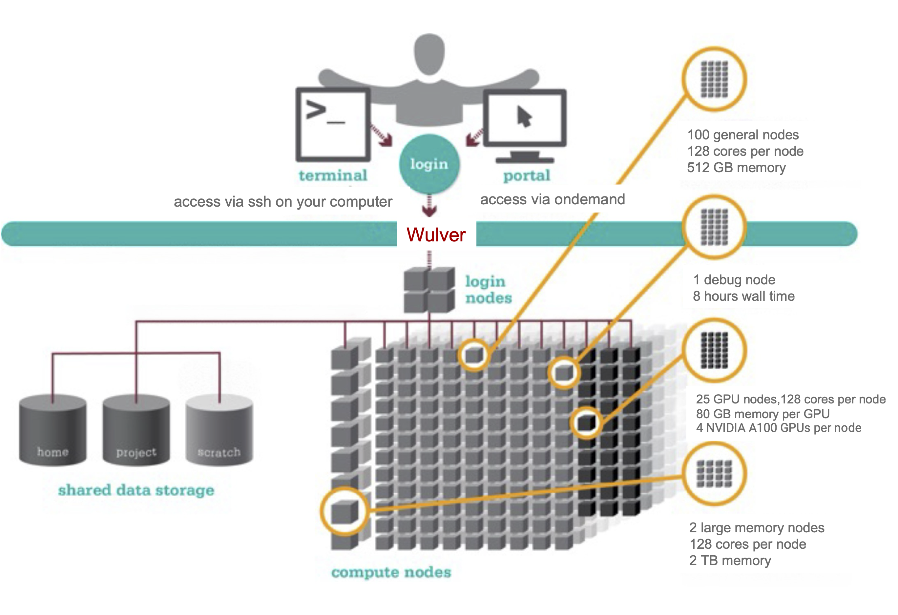

# Welcome to Hands-On with Wulver!

### What is Wulver?
[Wulver](https://hpc.njit.edu/clusters/wulver/) is NJIT's newest High Performance Computing Cluster, which went into production in early 2024. Wulver is located in Piscataway, NJ.  
 It has lots of unique architectural features that we'll explore today, including:

| |100 Compute Nodes | 2 BigMem | 4 GPU Nodes |
|---|----------|--------|----------|
|CPU Type|2 64 Core AMD EPYC 7753|2 64 Core AMD EPYC 7753|2 64 Core AMD EPYC 7713|
|RAM/Node (GB)|512| 2048| 512|
|GPU Type|-|-|4 nVIDIA A100 per node|
|GPU Memory (BG)|-|-|80|
|Total CPUs|12800|256|3200|
|Total RAM (TB)|50|4|12.5|

  

### Navigating this Session
Here you will find various resources
to help get you up and running on Wulver. We'll take a deep look at the
system's design, discuss how research teams write programs for and run
workloads on Wulver, and you'll get to run on your own. The session is guided by
hands-on [***challenges***](challenges).

The [first challenge](./challenges/Access_Frontier_and_Clone_Repo) is to
successfully log into Wulver and clone this repository.

Each challenge has its own sub-directory under `/challenges/`, and includes a
README.md file and any additional files for that challenge. Challenges range in
difficulty from introductory to very complex, and may require research and
reference materials outside of what's provided in this repository.

&nbsp;

### Helpful Links

#### [   Official Frontier User Guide & Documentation](https://docs.olcf.ornl.gov/systems/summit_user_guide.html)

#### [   SchedMD Slurm Documentation (scheduler)](https://slurm.schedmd.com/documentation.html)

 

 

  
    

